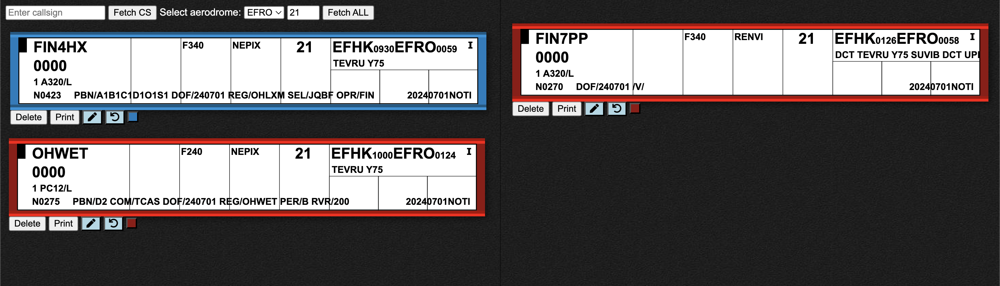

# Electronic Flight Strip application

The eStip web application is designed to be used for VATSIM simulation purposes only at Finnish regional aerodromes.
This app is simulating real life air traffic controller flight progress strips in Finnish air traffic control towers.

**Flight simulation purposes only!**

- [**Link to application**](https://estrip.lusep.fi/)

### Features
- Fetch flight data from VATSIM json API
- Display aircraft data on a flight strip format
- Flight strips have different colors based on state of flight at corresponding aerodrome
- Ability to draw over a flight strip to add custom information
- Ability to write over a flight strip to add custom information
- Cancel button will any custom changes
- Print function (will print out all flight strips as PDF)

### Screenshot

